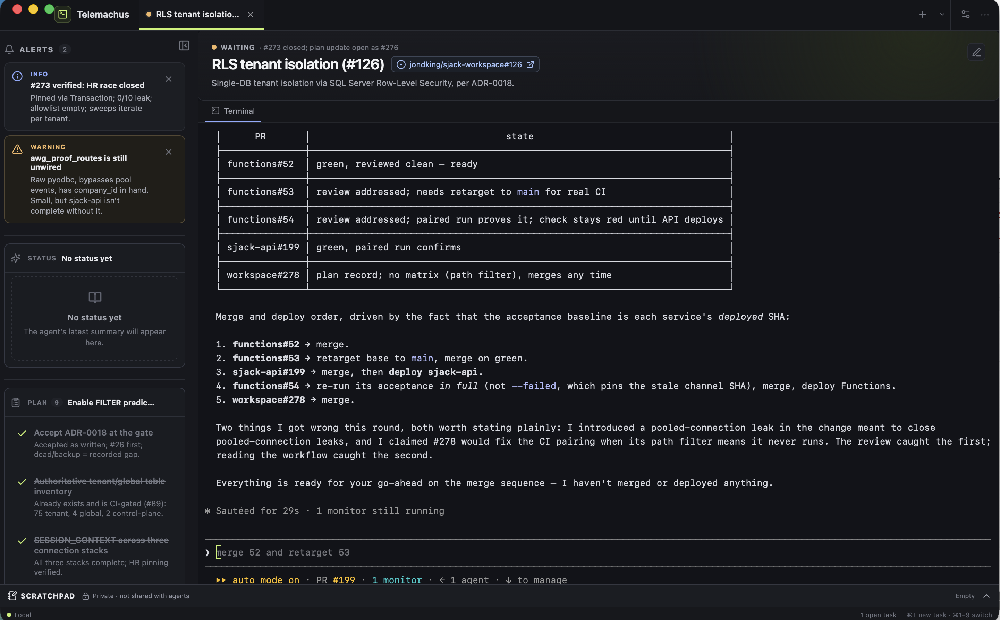
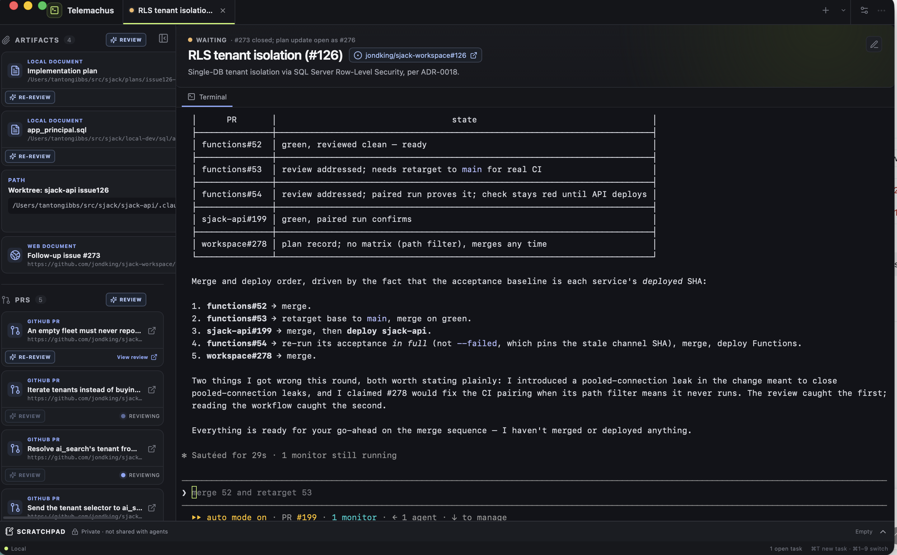

# Telemachus

A local, task-focused terminal workspace for Claude, Codex, and humans.

Telemachus keeps a real interactive terminal beside durable context for the
work: alerts, human to dos, current status, a plan, related documents, and open
pull requests. Instead of reconstructing the state of a long agent session from
its transcript, you can glance at the task screen and see what is happening,
what needs your attention, and what comes next.



Each tab is an independent task with its own live shell and presentation state.
Claude, Codex, or any shell script can update the screen through one
task-scoped command, `agent-ui`; no MCP setup is required. Telemachus also
includes a private, hideable scratchpad for human notes that is never exposed
to the agent.

Telemachus provides:

- one durable task tab per live terminal session;
- resumable Claude or Codex session IDs captured in each task header;
- agent-maintained Status, Plan, Alerts, Artifacts, and PR sections;
- human actions collected in a To do section;
- background Codex or Claude reviews for pull requests and local documents;
- links from task context to local files, web documents, GitHub issues, and PRs;
- accessible text scaling and hover magnification; and
- a private human scratchpad outside the agent integration.

## Start every agent session with the instructions

When you launch Claude or Codex in a Telemachus terminal, tell it:

> Before doing any work, run `agent-ui instructions` and follow the guidance it
> prints. Keep the Telemachus task screen current throughout this session.

Do this at the beginning of every session. `agent-ui instructions` prints a
compact 2–3 KB operating guide for using the Status, Plan, Alerts, To do,
Artifacts, and PR sections. Detailed command syntax, examples, and enum values
live in `agent-ui help`. Keeping both in the CLI means the agent receives
guidance that matches the version of Telemachus you are running.

## Prerequisites

- Node.js 20+
- Rust 1.88+
- macOS developer tools
- GitHub CLI (`gh`), installed and authenticated
- At least one reviewer CLI: [Codex CLI](https://developers.openai.com/codex/cli)
  or Claude Code, installed and authenticated

Each task tab defaults both review panes to the other agent: a Codex terminal
defaults reviews to Claude, and a Claude terminal defaults reviews to Codex.
Install Codex, Claude Code, or both depending on which reviewers you intend to
select. These CLIs are system prerequisites and are not installed by this
project's npm dependencies.

```bash
npm install --global @openai/codex
codex login
codex --version
codex login status

npm install --global @anthropic-ai/claude-code
claude --version

gh auth login
gh auth status
```

## Run it

```bash
git clone https://github.com/thgibbs/telemachus.git
cd telemachus
npm install
npm run desktop
```

`npm run desktop` launches **Telemachus Dev** with the existing development
application data. To build and install a separate production app in
`~/Applications`, run:

```bash
npm run install:mac
```

The installer opens **Telemachus** after copying it. Right-click its Dock icon
and choose **Options → Keep in Dock**. The installed app uses the production
identifier `com.telemachus.desktop`, so its tasks and settings are isolated from
Telemachus Dev. Reinstalling preserves the previous app bundle as a timestamped
backup in the same Applications directory.

The first launch creates an untitled task. Every terminal opened by Telemachus has
the `agent-ui` command ready to use:

```bash
agent-ui instructions
agent-ui doctor
agent-ui demo
agent-ui help
```

No MCP server, endpoint configuration, token copy, or working-directory
assumption is required. The application installs its bundled CLI into a private
application-data directory and prepends that directory to the child terminal's
`PATH`.

## How agents update the screen

The session-start instruction above is usually all you need. If you prefer a
more explicit prompt, use:

> Run `agent-ui instructions` before starting. Then keep this task's Telemachus
> screen current with `agent-ui`: maintain the task status, plan, artifacts,
> pull requests, summary, alerts, and human to dos as the work changes.

The agent can then update each panel directly:

```bash
agent-ui task set --title "Fix checkout" \
  --issue-url https://github.com/acme/store/issues/41 \
  --status working \
  --message "Reproducing the failure"

agent-ui plan add reproduce "Reproduce the failure" --status in_progress
agent-ui plan update reproduce --status completed

agent-ui summary set --headline "Root cause found" \
  --body "The stale cache key is shared across tenants."

agent-ui alert raise cache-risk "Cache invalidation required" \
  --severity warning --message "Invalidate after deploy."

agent-ui artifact add patch "Checkout patch" src/checkout.js \
  --type path --status modified

agent-ui artifact add report "Verification report" /absolute/path/report.md \
  --type local_document --status generated

agent-ui artifact add design "Design document" https://example.com/design \
  --type web_document

agent-ui artifact add pr "Checkout fix PR" \
  https://github.com/acme/store/pull/42 --type github_pr \
  --meta github_state=open

agent-ui todo add deploy "Deploy the release to production"

agent-ui todo add rollout "Choose the rollout strategy" --blocking --timeout 300
```

Use stable IDs such as `reproduce`, `cache-risk`, and `rollout`; subsequent
commands can update, clear, or remove those entries without screen scraping.
The issue link lives beside the task title and is suppressed from Artifacts if
it is reported twice. The desktop app also removes closed or merged PRs after
checking GitHub; an agent can make that immediate with
`agent-ui artifact update pr --meta github_state=closed`.

Telemachus also watches each task's rendered terminal buffer for GitHub pull
request links. After terminal activity settles, it verifies newly discovered
links with the authenticated GitHub CLI and adds only open PRs that are not
already present in Artifacts. Discovery is bound to the exact PTY session for
that task, and wrapped terminal lines are reconstructed before scanning.
Closed PRs and failed lookups are not added.

Every open PR and local-document artifact has a **Review** button. The
Artifacts and PRs headings also provide bulk review actions for their eligible
items. An arrow-only menu beside each heading's Review button selects Codex or
Claude for that pane in that task tab. Both panes default to the opposite of
the attached terminal agent and remember explicit choices independently; newly
added documents and PRs automatically use their containing pane's reviewer.

Reviews run non-interactively in an isolated temporary Git workspace and do not
create or replace a terminal tab. Codex uses `codex exec` with `gpt-5.6-sol` at
high reasoning. Claude runs headlessly with `claude -p`. The selected reviewer
receives the linked GitHub issue and artifacts. PR reviews are submitted to
their pull requests. Local-document reviews are saved as temporary Markdown
files instead of being posted to GitHub; their cards can copy the review or
open it in Zed. Local-document re-reviews receive the prior saved review as
explicitly labeled historical context.
Cards show **Reviewing** while a run is active and provide **View review** after
it completes. The action then becomes **Re-review**, with completed re-reviews
counted on the card. A run that exits without a newly submitted PR review or
nonempty local review file is shown as failed and can be retried. Active reviews
can be cancelled from their cards; Telemachus terminates the background reviewer
and also cleans up active review processes when a task or the app closes.



Run `agent-ui instructions` for agent workflow guidance, or see
[CLI.md](CLI.md) for the complete command and JSON reference.

## Publish the whole screen

For an initial render or atomic agent handoff, pass one JSON document:

```bash
agent-ui publish --stdin <<'JSON'
{
  "task": {
    "title": "Ship the editor",
    "issue_url": "https://github.com/acme/store/issues/41",
    "status": "working",
    "status_message": "Running verification"
  },
  "plan": [
    {
      "id": "build",
      "title": "Build release",
      "status": "completed"
    },
    {
      "id": "verify",
      "title": "Run checks",
      "status": "in_progress"
    }
  ],
  "summary": {
    "headline": "Implementation is ready",
    "sections": [
      {
        "id": "result",
        "heading": "Result",
        "body": "The command-line bridge is connected."
      }
    ]
  },
  "alerts": [],
  "artifacts": [
    {
      "id": "release",
      "type": "path",
      "label": "Release binary",
      "path_or_url": "src-tauri/target/release/agent-ui",
      "status": "generated"
    }
  ]
}
JSON
```

`publish` applies revision-checked typed operations in order. It intentionally
does not alter human to dos, because replacing pending work or a pending
decision could lose human input.

## Task-scoped environment

Telemachus injects these values into every child terminal:

- `AGENT_UI_CLI` — absolute path to the installed command
- `AGENT_UI_ENDPOINT` — random loopback bridge address
- `AGENT_UI_TASK_ID` — current task scope
- `AGENT_UI_CREDENTIAL` — random credential for this task and app session
- `AGENT_UI_TOKEN` — backward-compatible alias for the same credential
- `AGENT_UI_PROTOCOL_VERSION` — presentation protocol version
- `AGENT_UI_SOURCE` — default operation source

The credential is passed directly to child processes and is not written to
shell history or persisted by the application. The filter-safe
`AGENT_UI_CREDENTIAL` name lets Codex lifecycle hooks authenticate even when
Codex applies its default subprocess filter for names containing `TOKEN`.

Claude and Codex `SessionStart` hooks can pipe their JSON input to:

```bash
agent-ui session attach --provider claude --stdin --output quiet
agent-ui session attach --provider codex --stdin --output quiet
```

The command is task-scoped and records the provider, session ID, working
directory, and model. Telemachus shows that session in the task header; clicking
it copies the complete `claude --resume ...` or `codex resume ...` command.
Hooks should skip the command when `AGENT_UI_TASK_ID` is unset so normal
terminal sessions remain unaffected.

## Private scratchpad

Each task has a hideable scratchpad across the bottom of the workspace. Notes
auto-save locally and restore with the task. Scratchpad content is stored
separately from the presentation document and is never returned by the local
bridge, exposed through `agent-ui`, or injected into terminal processes.

## Task tabs and terminal isolation

The top-bar plus button creates and activates a task immediately. Use the
adjacent chevron when you want to choose its starting directory. The tab strip
scrolls as it fills and always reveals the active task.

Each task owns one live shell. Switching tasks leaves every terminal mounted,
and a frontend remount reattaches to the existing task shell instead of
launching a replacement. Up to 2 MiB of recent terminal output is retained in
memory for reattachment; it is not persisted after the desktop app exits.
Shift+Enter sends Escape followed by Return, allowing Claude Code to insert a
newline without submitting the prompt.

## Sidebar text magnifier

Hover over meaningful text in the sidebar to show a larger visual copy in an
overlay. The magnified copy preserves the source item's colors, emphasis, icons,
and other text styling while enlarging its typography. The overlay also appears
when an interactive sidebar item receives keyboard focus, does not reflow the
panels, and never intercepts clicks.

The display-settings menu in the title bar also provides persistent Standard,
Large, and Extra large text sizes. This scales both application text and the
embedded terminal.

Agent-originated changes briefly highlight the affected task header, To do,
Plan, Artifacts, Status, or Alerts section. Human actions such as completing a
todo or clearing an alert do not trigger that highlight.

For development outside a Telemachus terminal, `npm link` exposes the same
`agent-ui` command globally, but write commands still require the task-scoped
environment above.

## Optional MCP adapter

The command line is the primary integration. For clients that specifically
require MCP, `node /absolute/path/to/editor/bin/agent-ui-mcp.mjs` remains
available as a stdio adapter. It uses the same task-scoped environment and typed
operation service as the CLI.

## Security boundary

The bridge contains typed task, presentation, human-todo, layout, and
terminal-session operations. It does not expose generic file reads/writes,
arbitrary execution, Git, GitHub, repository, or credential APIs.

The Rust host:

- owns PTYs, SQLite, task/session identity, and the loopback bridge;
- validates task scope, statuses, IDs, payload sizes, and revision checks;
- uses opaque terminal session IDs;
- binds the bridge to a random localhost port;
- injects a distinct random token into each task terminal;
- stores presentation state transactionally and does not persist terminal
  keystrokes or transcripts.

Displayed Markdown, paths, and URLs are untrusted presentation state. Raw HTML
is removed. Artifact links open only after an explicit click: local documents
are validated as absolute files and sent to Zed; web documents accept only
HTTP(S), and GitHub PR links must match an HTTPS `github.com/.../pull/<number>`
URL.

## Verification

```bash
npm run build
npm run test:bridge
npm run test:rust
npm run check:rust
npm run tauri -- build --no-bundle
```

Browser preview mode uses local storage and a non-interactive terminal shell:

```bash
npm run dev
```

The desktop app is the product path and is required for PTY, SQLite, task-token,
blocking-wait, and restart behavior.

## Current MVP boundaries

- One live terminal per task; terminal processes end when the app exits.
- Presentation state and panel dimensions restore after restart. Tabs with a
  saved Claude or Codex session automatically launch that provider's resume
  command in a new terminal.
- Task deletion is explicit and revokes scoped bridge access.
- No transcript persistence, archive browser, remote terminals, cloud sync,
  repository features, or autonomous orchestration.
